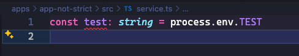

This repo shows an issue with vscode not honoring nested tsconfig.json files

run `pnpm build build-not-strict`
notice it builds successfully.

But even though build is successful, vscode shows errors in the editor

